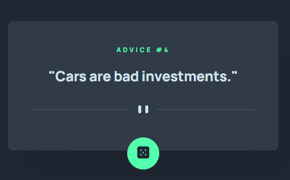

# Frontend Mentor - Advice generator app solution

This is a solution to the [Advice generator app challenge on Frontend Mentor](https://www.frontendmentor.io/challenges/advice-generator-app-QdUG-13db). 
## Table of contents

- [Overview](#overview)
  - [The challenge](#the-challenge)
  - [Screenshot](#screenshot)
  - [Links](#links)
- [My process](#my-process)
  - [Built with](#built-with)
  - [What I learned](#what-i-learned)
  - [Continued development](#continued-development)
  - [Useful resources](#useful-resources)
- [Author](#author)
- [Acknowledgments](#acknowledgments)

**Note: Delete this note and update the table of contents based on what sections you keep.**

## Overview

### The challenge

Users should be able to:

- View the optimal layout for the app depending on their device's screen size
- See hover states for all interactive elements on the page
- Generate a new piece of advice by clicking the dice icon

### Screenshot

Mobile:  
  


Tablet and up:



Hover state on button:


### Links

- Solution URL: [https://github.com/dominikapap/FrontendMentor-advice-generator-app](https://github.com/dominikapap/FrontendMentor-advice-generator-app)
- Live Site URL: [https://dominikapap-advice-generator.netlify.app/](https://dominikapap-advice-generator.netlify.app/)

## My process

### Built with

- Semantic HTML5 markup
- SASS/SCSS,CSS custom properties
- FlexboX
- Mobile-first workflow
- RWD


### What I learned

How to connect with API using axios:


```js
const getAdvice = async () => {
  try {
    const res = await axios.get("https://api.adviceslip.com/advice");
    const slipId = res.data.slip.id;
    const slipAdvice = res.data.slip.advice;
    adviceNum.innerHTML = slipId;
    adviceText.innerHTML = '"' + slipAdvice + '"';
  } catch (e) {
    alert("Something went wrong, please try again later.");
  }
};
```


## Author

- Linkedin - [My LinkedIn profile](https://www.linkedin.com/in/dominika-papierska-1ba09311a/)
- Frontend Mentor - [@dominikapap](https://www.frontendmentor.io/profile/dominikapap)
- Email - domi.papierska@gmail.com

